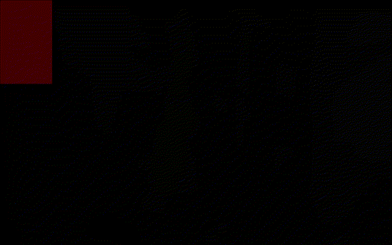

# UF2S8

> **U**nnamed **F**ixed **2**-byte **S**imple **8**-bit — A custom computer architecture with a full toolchain.

[](LICENSE)


UF2S8 is a custom 8-bit computer architecture designed from scratch, featuring a two-pass assembler, an SDL3-based emulator with hardware-accelerated 2D graphics, and a SystemVerilog hardware implementation.

## Features

- **Fixed 16-bit instruction encoding** — Clean, orthogonal load/store ISA
- **8 general-purpose registers** with 4 virtual 16-bit address register pairs
- **Hardware 2D blitter** — Rectangle fill, memory/VRAM blits, transparency, alpha blending, clipping, flipping, and line drawing
- **Bank-switched memory** — 8 × 8 KB windows mapping to a 256-bank (2 MB) pool (128 ROM, 120 RAM, 8 VRAM) over a 64 KB address space
- **Configurable graphics** — Software-defined resolution with 1/2/4/8 bpp colour depth modes (RGB332)
- **Interrupt system** — Timer, keyboard, software interrupts with a 128-entry vector table
- **Standardised ABI** — Fastcall calling convention with defined register roles and stack frame layout



## Project Structure

| Directory    | Description                                                  |
|--------------|--------------------------------------------------------------|
| `assembler/` | Two-pass assembler (C, GNU23) — lexer, encoder, symbol table |
| `emulator/`  | SDL3-based emulator (C, GNU23) — CPU, graphics, debugger     |
| `software/`  | Example assembly programs (graphics demos, fonts)            |
| `verilog/`   | SystemVerilog implementations (Single-cycle, Multicycle, & 5-Stage Pipelined) |
| `tools/`     | Utilities — `img2bit.py` image-to-sprite converter           |

## Building

### Prerequisites

| Dependency | Purpose              |
|------------|----------------------|
| GCC 14+    | C23 support required |
| SDL3       | Emulator display     |
| pkg-config | Library discovery    |

### Build the Assembler

```sh
cd assembler && make
```

### Build the Emulator

```sh
cd emulator && make
```

Both targets support `make debug=1` for debug builds with full symbols.

### Run Hardware Simulation

The SystemVerilog cores can be simulated using Icarus Verilog:

```sh
# Pipelined core (full test suite with SWI, WFI, & Hardware Interrupts)
cd verilog/pipelined
../../assembler/bin/assembler test.s test.bin
iverilog -g2012 -o tb_cpu *.sv
vvp tb_cpu

# Single-cycle core
hexdump -v -e '1/1 "%02X\n"' output.bin > verilog/singlecycle/mem.hex
cd verilog/singlecycle && iverilog -g2012 -o cpu_sim *.sv && vvp cpu_sim
```

### Running Tests

Both the assembler and emulator have test suites that can be run with:

```sh
# Run assembler tests
cd assembler && make tests

# Run emulator tests
cd emulator && make tests
```

## Usage

### Assemble a program

```sh
./assembler/bin/assembler program.s output.bin
```

### Run it in the emulator

```sh
./emulator/bin/emulator -g output.bin
```

### Convert an image to a sprite

```sh
python3 tools/img2bit.py sprite.png -o sprite.s --bpp 1 --format asm
```

The `img2bit.py` tool supports 1/2/4/8 bpp quantisation, resizing, inversion, stride padding, and can output assembly (`.db` directives), raw binary, or hex dump formats.

## Architecture Overview

UF2S8 is a load/store architecture with fixed-width 2-byte instructions and 8-bit data paths. Addresses are 16-bit, formed by pairing general-purpose registers.

| Property             | Value                                         |
|----------------------|-----------------------------------------------|
| Data width           | 8-bit                                         |
| Address width        | 16-bit (register pairs)                       |
| Instruction width    | Fixed 16-bit                                  |
| Registers            | 8 GPR (`r0`–`r7`), 4 address (`a0`–`a3`)      |
| Endianness           | Little-endian                                 |
| Stack                | Grows downward, hardware SP via CSR           |
| Flags                | Carry, Zero, Negative, Overflow, Interrupt    |

### Memory Map

```
0x0000 ┬───────────────┐
       │  Window 0     │ 8 KB — Banked (256-bank pool)
0x2000 ├───────────────┤
       │  Window 1     │ 8 KB — Banked (256-bank pool)
0x4000 ├───────────────┤
       │  Window 2     │ 8 KB — Banked (256-bank pool)
0x6000 ├───────────────┤
       │  Window 3     │ 8 KB — Banked (256-bank pool)
0x8000 ├───────────────┤
       │  Window 4     │ 8 KB — Banked (256-bank pool)
0xA000 ├───────────────┤
       │  Window 5     │ 8 KB — Banked (256-bank pool)
0xC000 ├───────────────┤
       │  Window 6     │ 8 KB — Banked (256-bank pool)
0xE000 ├───────────────┤
       │  Window 7     │ 7.5 KB — Banked (256-bank pool)
0xFE00 ├───────────────┤
       │  HW Registers │ 256 B — Blitter, graphics, keyboard, timer, banking
0xFF00 ├───────────────┤
       │  Vector Table │ 256 B — Banked (Window 7)
0xFFFF ┴───────────────┘
```

## Documentation

| Document                              | Contents                                        |
|---------------------------------------|-------------------------------------------------|
| [ISA Reference](isa.md)              | Full instruction set encoding and descriptions  |
| [ABI Specification](abi.md)          | Calling convention, register roles, stack frames |
| [Hardware Architecture](emulator/arch.md) | Memory map, blitter, graphics, I/O registers |

## Example Programs

| Program                | Description                                  |
|------------------------|----------------------------------------------|
| `software/graphics_demo.s` | Sprite rendering and blitter operations   |

## Use of AI tools

I have used **Antigravity**, to help me with the development of this project. Antigravity has been used to generate code snippets, fix bugs, and refactor code, most of the code was written by a human, and edited by a human.

## License

This project is licensed under the [GNU General Public License v3.0](LICENSE).

```
Copyright (C) 2026 lyrah0
```
