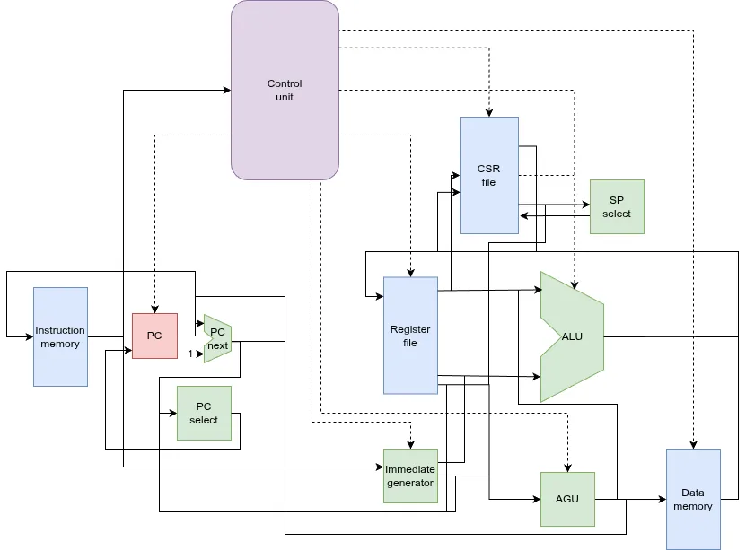
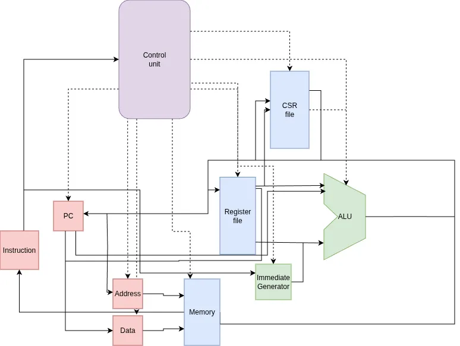

# UF2S8 Verilog Implementation

> **Hardware implementation of the UF2S8 CPU in SystemVerilog.**

[](../README.md)
[](../LICENSE)

This directory contains the hardware implementation of the UF2S8 architecture. The goal is to provide a synthesizable CPU core that can run the same binaries as the emulator.

## Features

- **Modular Design** — Clean separation between the ALU, Register File, Control Unit, and Address Generation Unit.
- **Single-Cycle Execution** — A complete instruction is executed in one clock cycle.
- **Multicycle Design** — Complete implementation focusing on shared components and state-machine control. Includes a Wishbone interface. Notably, this design features only a single shared adder for all arithmetic and address calculations.
- **Simulation Ready** — Includes a testbench for functional verification using Icarus Verilog.
- **Roadmap** — Moving towards pipelined designs.

## Directory Structure

| Path | Description |
|------|-------------|
| `singlecycle/` | Standard single-cycle CPU implementation. |
| `multicycle/`  | Multicycle CPU implementation with Wishbone interface. |

## Single-Cycle Architecture


*Single-cycle data & control paths*

## Multicycle Architecture


*Multicycle data & control paths*

## Simulation

The hardware implementation can be simulated using **Icarus Verilog**.

### 1. Generate Memory Image

The simulation loads program code from a file named `mem.hex`. You can generate this from an assembled `.bin` file using `hexdump`:

```sh
hexdump -v -e '1/1 "%02X\n"' program.bin > verilog/singlecycle/mem.hex
```

### 2. Run Simulation

Navigate to the implementation directory and run the testbench:

```sh
cd verilog/singlecycle
iverilog -g2012 -o cpu_sim *.sv
vvp cpu_sim
```

This will produce a trace log of register states and a `cpu_sim.vcd` file for viewing waveforms (e.g., with GTKWave).

## Component Breakdown

| File | Module | Description |
|------|--------|-------------|
| `cpu.sv` | `cpu` | Top-level CPU module connecting all components. |
| `alu.sv` | `alu` | Arithmetic Logic Unit. |
| `control_unit.sv`| `control_unit` | Main decoder and control signal generator. |
| `register_file.sv`| `register_file` | 8 general-purpose 8-bit registers. |
| `csr_file.sv` | `csr_file` | Control and Status Registers (including flags and SP). |
| `agu.sv` | `agu` | Address Generation Unit for memory operations. |
| `testbench.sv` | `testbench` | Simulation environment with a 64KB memory model. |

## License

This component is part of the UF2S8 project and is licensed under the [GNU General Public License v3.0](../LICENSE).
