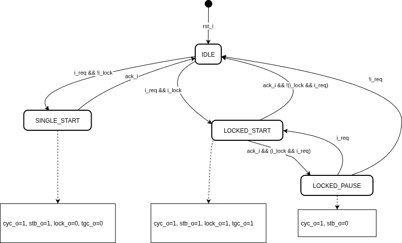

# Wishbone Master Datasheet

This document describes the Wishbone Master interface module (`wb_master`) used in the **UF2S8 Multicycle CPU Core**. The module serves as the bridge between the internal CPU CPU-side control/data signals and a standard external Wishbone Bus.

---

## 1. Specification Compliance

- **Wishbone Revision:** Compatible with **Wishbone B3/B4** specifications.
- **Port Size:** 8-bit data port, 16-bit address port (64 KB address space).
- **Port Granularity:** 8-bit (byte-addressable).
- **Interconnection Type:** Point-to-point, shared bus, or crossbar switch.
- **Cycle Types Supported:** 
  - Standard Single Read/Write cycles.
  - Locked Block transfers (for instruction fetching). 

---

## 2. Signal Descriptions

The `wb_master` module interfaces the internal CPU controller to the external Wishbone interconnect.

### 2.1. Wishbone Bus Interface (External)

| Signal | Width | Direction | Description |
| :--- | :---: | :---: | :--- |
| `clk_i` | 1 | Input | Master Clock Input. All Wishbone transactions are synchronous to this clock. |
| `rst_i` | 1 | Input | Synchronous Active-High Reset. Resets master output control signals. |
| `ack_i` | 1 | Input | Acknowledge Input. Asserted by the active slave to indicate termination of a transfer cycle. |
| `dat_i` | 8 | Input | Data Input. 8-bit data path from the slave to the master. |
| `stb_o` | 1 | Output | Strobe Output. Indicates that a valid data transfer cycle is active. |
| `cyc_o` | 1 | Output | Cycle Output. Active-high signal indicating a valid bus cycle is in progress. |
| `we_o`  | 1 | Output | Write Enable Output. `1` indicates a write transaction; `0` indicates a read transaction. |
| `lock_o`| 1 | Output | Lock Output. Asserted to lock the current cycle and prevent other masters from gaining bus access. |
| `tgc_o` | 8 | Output | Cycle Tag Output. Indicates the type of cycle being executed: `0` for single, `1` for block/locked cycle. |
| `dat_o` | 8 | Output | Data Output. 8-bit data path from the master to the slave. |
| `adr_o` | 16 | Output | Address Output. 16-bit address path to select a memory/peripheral location. |

### 2.2. CPU Core Interface (Internal)

| Signal | Width | Direction | Description |
| :--- | :---: | :---: | :--- |
| `i_we`   | 1 | Input | CPU Write Enable. Asserted if the CPU intends to perform a write transfer. |
| `i_req`  | 1 | Input | CPU Request. Asserted by the CPU to initiate a bus transaction. |
| `i_lock` | 1 | Input | CPU Lock request. Keep cycle open across multiple transfers. |
| `i_data` | 8 | Input | CPU Write Data. Data to be output to the bus (`dat_o`). |
| `i_addr` | 16 | Input | CPU Address. Target address to be output to the bus (`adr_o`). |
| `o_ready`| 1 | Output | CPU Ready. Handshake flag signaling to the CPU that the transfer is complete. |
| `o_data` | 8 | Output | CPU Read Data. Data read from the Wishbone bus (`dat_i`). |

---

## 3. Theory of Operation

The Wishbone Master translates CPU memory accesses into Wishbone bus transactions. It features combinational bypass for data and address lines, minimizing access latency.

### 3.1. Combinational Logic Paths

Data and addresses are combinationally forwarded to minimize latency:
- `dat_o` is directly assigned from `i_data`.
- `adr_o` is directly assigned from `i_addr`.
- `o_data` is directly assigned from `dat_i`.
- `o_ready` is active when the slave acknowledges (`ack_i`) while a strobe is active (`stb_o`).
  $$\text{o\_ready} = \text{ack\_i} \wedge \text{stb\_o}$$

### 3.2. Bus Cycle Control State Machine

The master transitions state based on the register values of `cyc_o` and `stb_o` on every rising edge of `clk_i`:



1. **Idle State (`!cyc_o`)**:
   - If `i_req` is asserted, `cyc_o` and `stb_o` are set to `1` on the next rising clock edge.
   - `we_o` is registered from `i_we`.
   - `lock_o` and `tgc_o` are registered from `i_lock`.
2. **Active Cycle (`cyc_o`)**:
   - **Transaction Termination**: If `stb_o` is active and `ack_i` is received:
     - `stb_o` is deasserted (`0`).
     - If both `i_lock` and `i_req` are still active, `cyc_o` remains active (`1`) to keep the bus locked.
     - Otherwise, the cycle is terminated and `cyc_o` returns to `0`.
   - **Locked Phase Resumption**: If the cycle is locked (`cyc_o` remains `1` but `stb_o` is `0`), and the CPU requests another transfer (`i_req` is `1`), `stb_o` is re-asserted and `we_o` is updated to `i_we` for the next phase.

---

## 4. Timing Diagrams

The following ASCII timing diagrams illustrate the bus handshake during standard operations. All outputs change on the rising edge of `clk_i`.

### 4.1. Standard Single Read Cycle (with 1 wait-state)

During a standard read, `cyc_o` and `stb_o` are asserted simultaneously in response to `i_req`. The slave responds with `ack_i` and the read data `dat_i`, which are sampled on the next rising clock edge.

lock_o, tgc_o, i_lock are assumed low.

```text
             __    __    __    __   
clk_i     __/  \__/  \__/  \__/  \__
                   _____            
i_req     ________/     \___________
i_we      __________________________
i_addr    XXXXXXXX[   valid   ]XXXXX
                         _____      
cyc_o     ______________/     \_____
                         _____      
stb_o     ______________/     \_____
we_o      __________________________
adr_o     XXXXXXXX[  i_addr   ]XXXXX
                         _____      
ack_i     ______________/     \_____
dat_i     XXXXXXXXXXXXXX[valid]XXXXX
o_data    XXXXXXXXXXXXXX[dat_i]XXXXX
                         _____      
o_ready   ______________/     \_____
```

- **Cycle Start**: The CPU requests a read by asserting `i_req` with `i_we = 0`. On the next rising edge, the master asserts `cyc_o` and `stb_o`, and forwards the address `adr_o = i_addr`.
- **Acknowledge**: The slave asserts `ack_i` and provides `dat_i`.
- **Completion**: On the rising edge where `ack_i` and `stb_o` are both active, `o_ready` goes high to inform the CPU, and the master deasserts `stb_o` and `cyc_o` to terminate the cycle.

---

### 4.2. Standard Single Write Cycle (with 1 wait-state)

During a standard write, `cyc_o` and `stb_o` are asserted simultaneously in response to `i_req`. The slave responds with `ack_i`. 

lock_o, tgc_o, i_lock are assumed low.

```text
             __    __    __    __   
clk_i     __/  \__/  \__/  \__/  \__
                   _____            
i_req     ________/     \___________
                   _____
i_we      ________/     \___________
i_addr    XXXXXXXX[   valid   ]XXXXX
i_data    XXXXXXXX[   valid   ]XXXXX
                         _____      
cyc_o     ______________/     \_____
                         _____      
stb_o     ______________/     \_____
                         _____
we_o      ______________/     \_____
adr_o     XXXXXXXX[  i_addr   ]XXXXX
dat_o     XXXXXXXX[  i_data   ]XXXXX
                         _____      
ack_i     ______________/     \_____
                         _____      
o_ready   ______________/     \_____
```

- **Cycle Start**: The CPU requests a write by asserting `i_req` and `i_we = 1`. On the next rising edge, the master asserts `cyc_o`, `stb_o`, and `we_o`, and forwards the address `adr_o = i_addr` and data `dat_o = i_data`.
- **Acknowledge**: The slave asserts `ack_i`.
- **Completion**: On the rising edge where `ack_i` and `stb_o` are both active, `o_ready` goes high to inform the CPU, and the master deasserts `stb_o` and `cyc_o` to terminate the cycle.

---

### 4.3. Locked Block Read Cycle (Double Read)

When executing multi-byte or sequential reads under lock (e.g., fetching a 16-bit instruction via two sequential 8-bit memory accesses), the master holds `cyc_o` high to keep the bus locked between reads.

```text
             __    __    __    __    __    __    __   
clk_i     __/  \__/  \__/  \__/  \__/  \__/  \__/  \__
                   _____       _____                  
i_req     ________/     \_____/     \_________________
                   _____       _____                  
i_lock    ________/     \_____/     \_________________
i_we      ____________________________________________
i_addr    XXXXXXXX[  addr 0   ][  addr 1  ]XXXXXXXXXXX
                         _______________________      
cyc_o     ______________/                       \_____
                         _____       _____            
stb_o     ______________/     \_____/     \___________
                         _______________________      
tgc_o     ______________/                       \_____
                         _______________________      
lock_o    ______________/                       \_____
we_o      ____________________________________________
adr_o     XXXXXXXX[  i_addr   ]XXXXXXXXXXXXXXXXXXXXXXX
                         _____       _____            
ack_i     ______________/     \_____/     \___________
dat_i     XXXXXXXXXXXXXX[valid]XXXXX[valid]XXXXXXXXXXX
o_data    XXXXXXXXXXXXXX[dat_i]XXXXX[dat_i]XXXXXXXXXXX
                         _____       _____            
o_ready   ______________/     \_____/     \___________
```

- **First Phase (Read 0)**: The CPU initiates the read transfer with `i_lock = 1`. The master asserts `cyc_o`, `stb_o`, and the address `Addr 0`. When the slave acknowledges with `ack_i` and provides `dat_i`, the first read completes at the rising clock edge.
- **Inter-phase State**: Since `i_lock` and `i_req` remain active, the cycle continues (`cyc_o = 1`), but the strobe is cleared (`stb_o = 0`) to signal the end of the first transfer.
- **Second Phase (Read 1)**: As the CPU requests the next address (`Addr 1`), the master drives `stb_o` high again. When the slave acknowledges with `ack_i` and provides `dat_i`, the second read completes, and both `stb_o` and `cyc_o` are released as `i_lock` is cleared.
